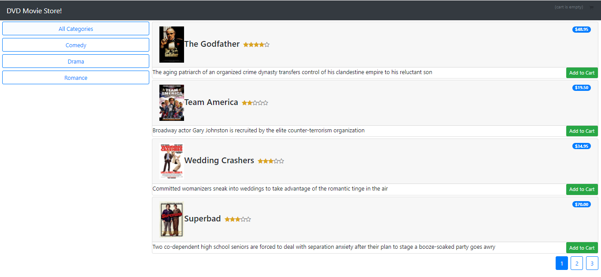
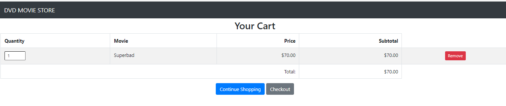
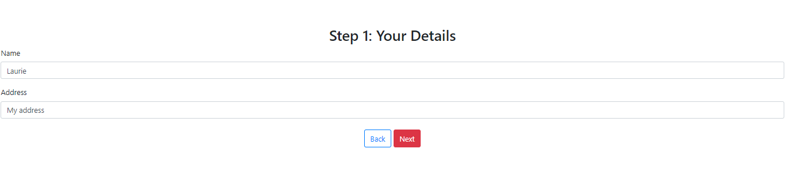
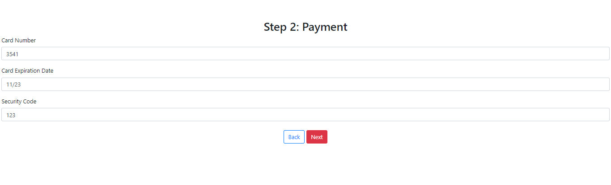
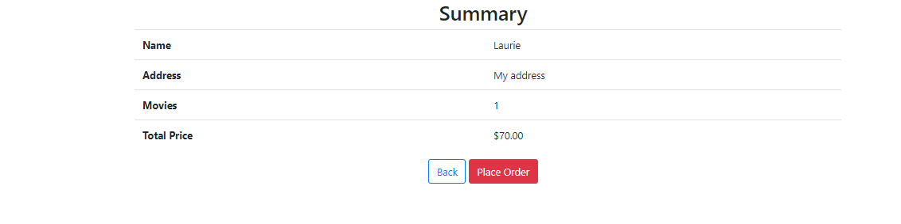
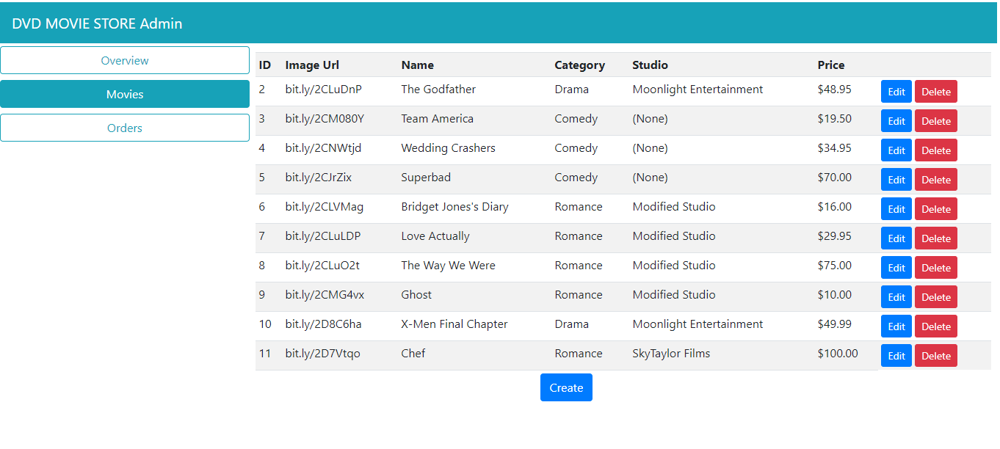
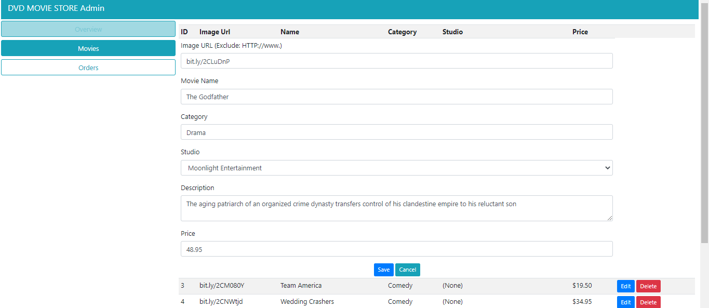
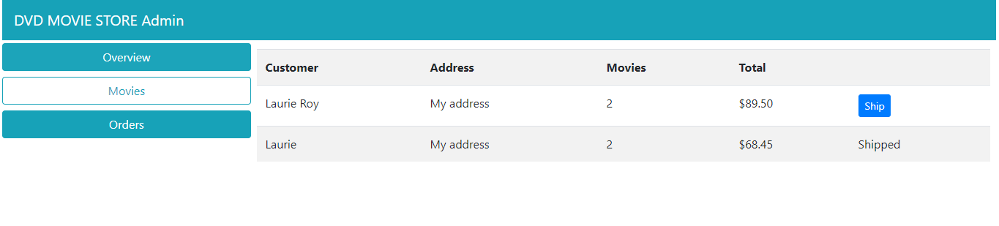

# DVDMovieStore

The app is a DVD movie store. The user may browse the movies, filter by comedy, drama or show all.
Admin can add, edit and delete the movie data. They may also see what movies have shipped.

This app was built in ASP.NET core 2.1 with Angular 5.2 (CLI version 1.7.0) template on windows 10. I followed a tutorial by Reynald Adolphe. 
Data is stored using SQL Server with EF core. Caching of cookies in the db for order and cart persistence is also enabled.
RESTful web services are used

### To install: 
Nav to the ClientApp, Run `NPM i` to install the node modules. Run the project with dotnet run e.g., DVDMovieStore> `dotnet watch run`

The movie has a short description, image, price and star rating.

User may Add movie to cart.

User may remove movie form cart, continue shopping or checkout.

At checkout, the user add name and address. Button is disabled until info is input.

Next page is adding payment information, again the next button is disabled until info is input.
  

The next page is a summary of the order inforation. User clicks submits order and is taken to a submitted page.

Clicking Done redirects to the main overview page.

Pagination has been added to show 4 movies per page.
Persistence has been added to maintain order and cart information on refresh.

Admin user can edit the movie data, add new movies and delete.

They can also Ship an order, or see which have shipped.

The above is following the tutorial. 

Next Steps:
* Add in better validation
* Add in testing

